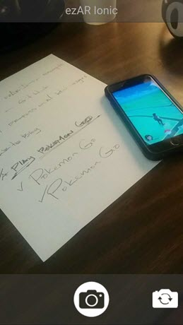

# ezar-ionic example application
Example single page Ionic app using the ezAR vidoeOverlay plugin to view camera 
preview on background.  

 

##Getting Started

Step-1.  Add the ezAR Cordova plugins to the project

     ionic plugin add <pathToEzAR>/plugins/com.ezartech.ezar.videooverlay
     ionic plugin add <pathToEzAR>/plugins/com.ezartech.ezar.snapshot
     
Step-2.  Add your target platform(s) to the project

     ionic platform add ios
    
or

     ionic platform add android

Step-3.  Build and install on device
Note: because of the ezAR camera requirement the app will only perform correctly when installed on a real mobile device.

##ezAR Docs and Tech Support
See [ezartech.com](http://ezartech.com) for documentation and support.

Please support ezAR socially. All tweets appreciated [@ezARTech](https://twitter.com/ezartech)

Copyright (c) 2015-2016, ezAR Technologies
